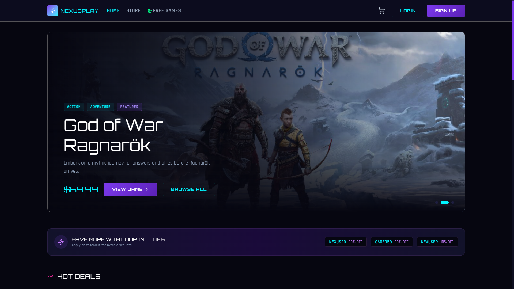
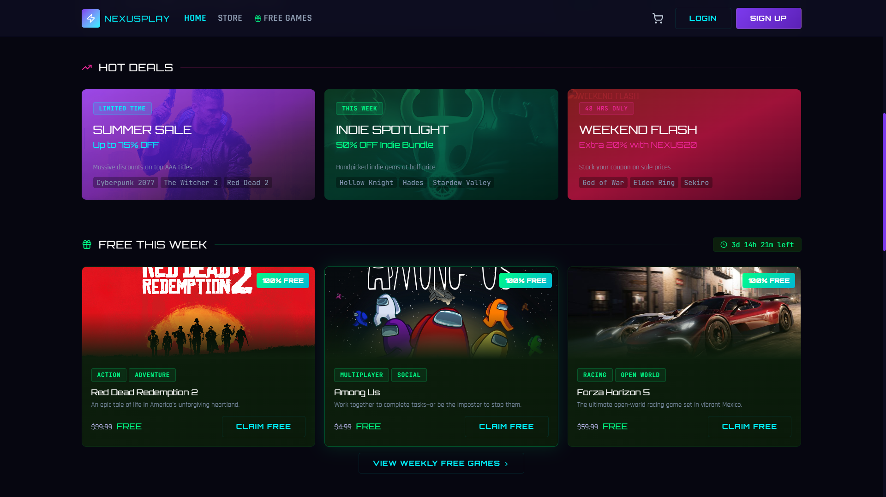
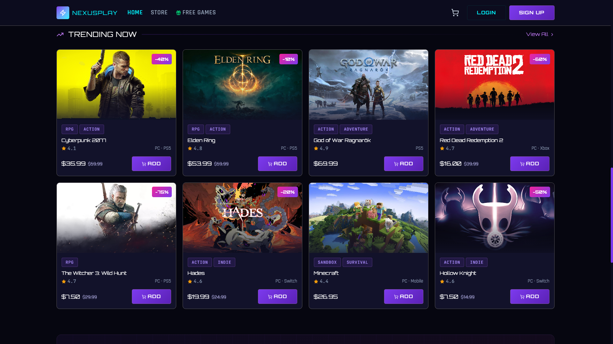
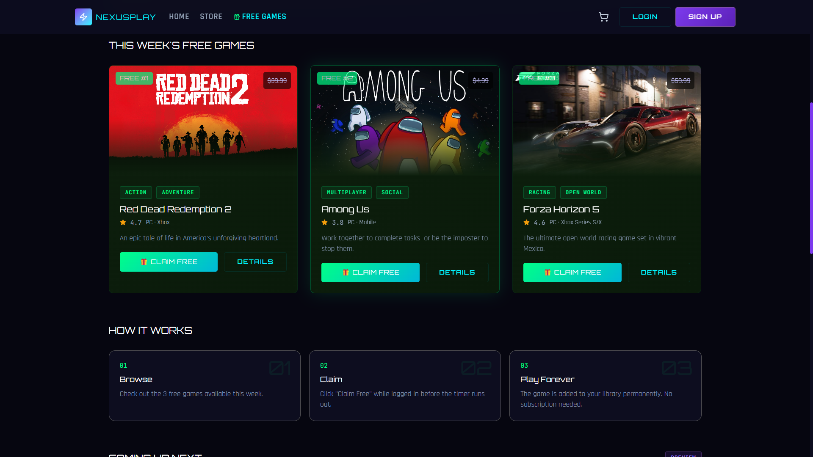

# 🎮 NexusPlay – Your Ultimate Game Discovery Platform



## 📖 Overview

**NexusPlay** is a modern, responsive web application that helps gamers discover their next favorite game. Built with React, it fetches real-time game data from the RAWG API and provides a seamless browsing experience with powerful filtering, search capabilities, and detailed game information.

---

## ✨ Features

| Feature | Description |
|---------|-------------|
| 🔍 **Smart Search** | Find games by name instantly |
| 🎯 **Genre Filtering** | Filter by RPG, FPS, Action, Strategy, and more |
| 📱 **Responsive Design** | Perfect on desktop, tablet, and mobile |
| 💰 **Price & Discounts** | See real-time pricing with discount badges |
| ⭐ **Rating System** | Community ratings out of 5.0 |
| 🆓 **Weekly Free Games** | Curated free-to-play highlights |
| 🖼️ **Working Images** | All game images load reliably |
| 📄 **Detailed Game Pages** | Deep dive into each game's info |
| 🔄 **API Fallback** | Seamless mock data when offline |

---

## 🖼️ Screenshots

### Homepage – Game Grid View

*Browse all games in a clean, responsive grid layout*

### Search & Filters

*Powerful search and genre filtering system*

### Weekly Free Games Section

*Curated collection of free-to-play titles*

### Mobile Responsive View

*Optimized for all screen sizes*

---

## 🚀 Live Demo

> **🔗 Live Link:** [**Click here to view the live project**](https://nexus-play-vert.vercel.app)
---

## 🛠️ Tech Stack

| Technology | Purpose |
|------------|---------|
|  | Frontend Framework |
|  | Styling |
|  | Game Data |
|  | Build Tool |
|  | Image CDN |

---


---

## 🏃‍♂️ Installation & Setup

### Prerequisites
- Node.js (v16 or higher)
- npm or yarn

### Steps

```bash
# 1. Clone the repository
git clone https://github.com/Ankitzoro/NexusPlay.git

# 2. Navigate to project folder
cd NexusPlay

# 3. Install dependencies
npm install

# 4. Start development server
npm run dev

# 5. Open browser and visit
http://localhost:5173
